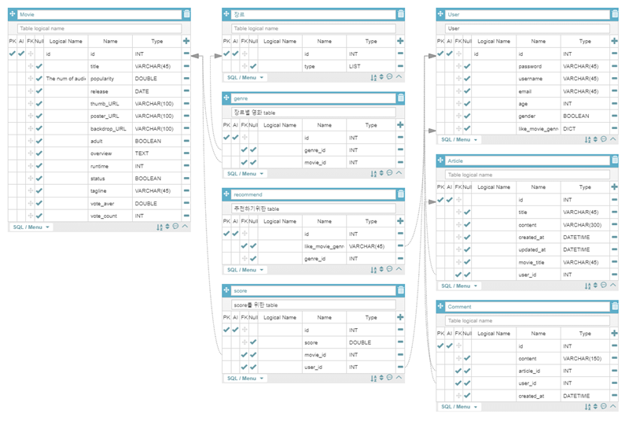
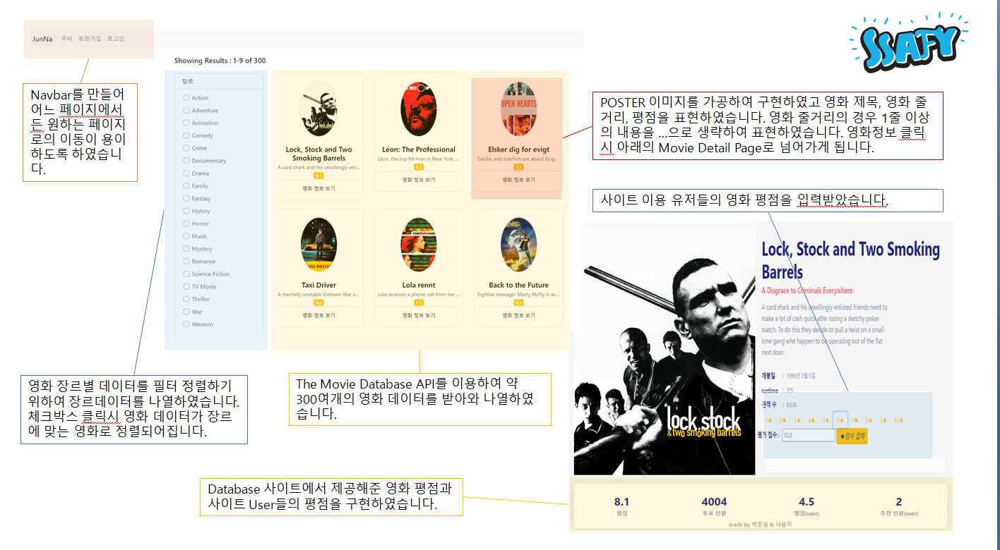
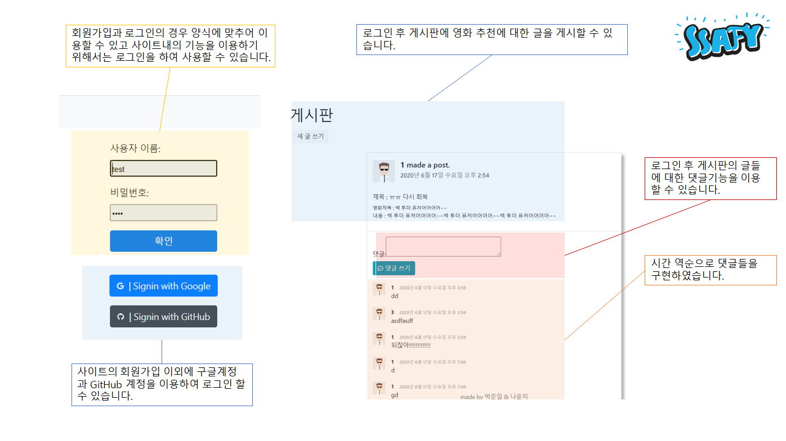

<h1 align="center">Welcome to junnamovie 👋</h1>
<p>
  
</p>

> show movie list and movie articles

### 🏠 [Homepage](http://ec2-18-218-2-164.us-east-2.compute.amazonaws.com/)

# JunNa Movie

- 배포 서버 URL

# 기본 설정

1. Python Web Framework : Django 2.1.15 Python 3.8.2
2. Django REST API 서버 & Vue.js
3. DB: SQLite

- 데이터 수집
  
  - The Movie Database(TMDb)
  
- 프로젝트 디렉토리 구조

- 데이터베이스 모델링(ERD)

  

- Django REST framework

- 시간 표현 : vue-moment 이용(cdn)

- text post type 출처.

  - https://www.bootdey.com/snippets/view/Social-post#html

- 기능 설명

  - nav bar 
  - movie - list, detail, create rank score
  - articles - articles list, create article, comments, create comment
  - login, logout, signup - with google and github

  

  

### ✨ [Demo](http://localhost:8000/)

## Install

```sh
pip install -r requirements
python manage.py makemigrations accounts articles movies
python manage.py migrate
python import_data.py
python manage.py runserver
```

## Author

👤 **jun & yun**

- Github: [@dmdekf](https://github.com/dmdekf)
- Github: [@Jun1](https://github.com/pji328)

## Show your support

Give a ⭐️ if this project helped you!

---

_This README was generated with ❤️ by [readme-md-generator](https://github.com/kefranabg/readme-md-generator)_
